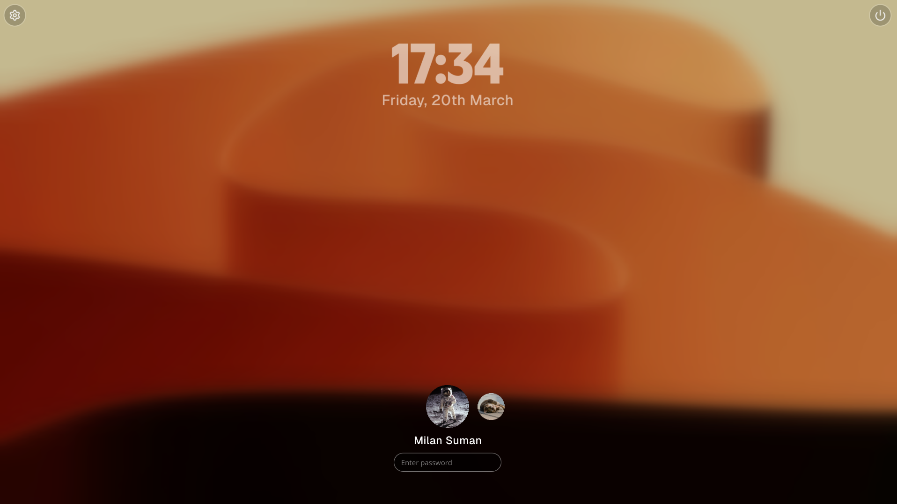

# SphinxOS

SphinxOS is an in-progress Linux desktop environment project focused on delivering a cohesive, modern desktop experience. The long-term direction includes a KWin-based desktop shell and strong app integration with GNOME Circle and other Linux-native tools.

The project is currently in its first implementation stage: a custom SDDM greeter theme.

## Project Status

- Stage: Early development
- Implemented: SDDM greeter theme (`greeter/`)
- Planned next milestones: Desktop session foundation, shell components, and app integration

## Current Component: Greeter

The `greeter/` directory contains a complete Qt/QML SDDM theme (`Theme-API 2.0`, `Qt 6`) with:

- Multi-screen aware layout with primary-screen login flow
- Animated clock/date lock screen behavior
- User list selector with avatar previews
- Password input with animated error feedback
- Session selector (desktop session switching)
- Power menu actions (sleep, reboot, shutdown)
- Configurable fonts, colors, and background through `theme.conf`

### Preview



## Using the Greeter Theme

Typical SDDM theme installation flow:

1. Copy the `greeter/` folder into your SDDM themes directory (commonly `/usr/share/sddm/themes/`).
2. Ensure the folder name is `sphinx` or update your SDDM config accordingly.
3. Set the theme in SDDM configuration.

Example:

```ini
# /etc/sddm.conf.d/sphinx.conf
[Theme]
Current=sphinx
```

After configuration, restart SDDM (or reboot) to apply.

## Configuration

Theme-level configuration lives in `greeter/theme.conf`:

- `background`: Background media path
- `color`: Accent color
- `headingFont`, `subHeadingFont`: Font file paths
- `headingFontSize`, `subHeadingFontSize`: Typography sizing
- `headingColor`: Primary text color

## Vision and Roadmap

SphinxOS is being developed toward a full desktop experience, including:

- KWin-based window management and compositor integration
- Desktop shell components (panels, launcher/workspace workflows, system UI)
- Curated application layer with GNOME Circle and related Linux apps
- Consistent visual identity and UX across login, shell, and apps
